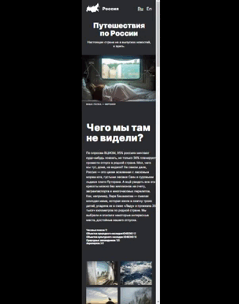

#  Проект «Путешествия по России»
**[Ссылка на проект](https://geniav.github.io/russian-travel/index.html)**

**Учебный проект** с целью применения знаний об адаптивной верстке на практике.

**STACK**

HTML, CSS, BЭM.

**ОПИСАНИЕ**

Проект представляет собой страницу с кратким описанием интересных мест России и оснащен полезными ссылками для осуществления путешествия.

**ЗАПУСК ПРОЕКТА**

   | Вариант | Описание |
| ------ | ------ |
| 1 | запуск из папки проекта _(файл index.html)_ |
| 2 | запуск в VSCode при помощи расширения [LiveServer](https://marketplace.visualstudio.com/items?itemName=ritwickdey.LiveServer) |
